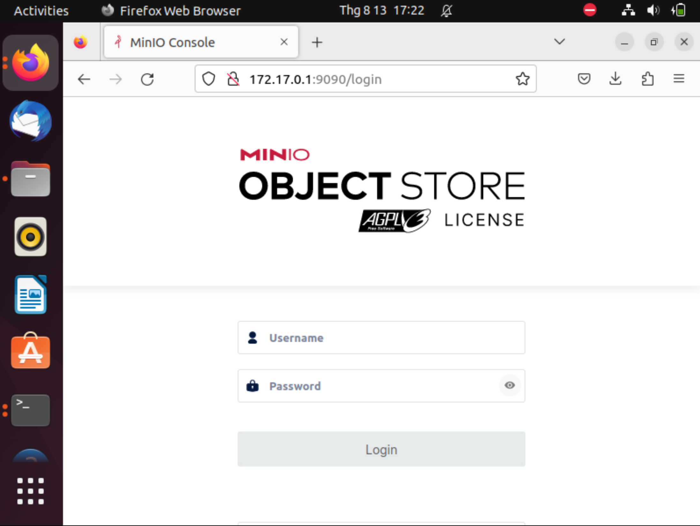

# COSC2156 Unix Systems Administration and Programming (Linux) - MinIO Storage
#### Project Start Date: 04/08/2023
#### Project End Date: 18/08/2023
#### Contribution (Saigon 11):
- Do Le Long An (s3963207)
- Vo Nguyen Khoi (s3891987)

## Assessment Details

Project should be built on a Unix system, either a bare metal, VM, usb-live (remember this might not be preserved between boots).  Remember this is a UNIX SYS ADMIN course, so the point of the exercise is to install on an existing unix OS.  The choice of Unix installation may constrain some features of installation, for example you may or may not be able to make an installation on a 'live' system preserve between reboots, if using a VM you may be limited in broader internet access.

## Project Background

[](https://min.io)

MinIO is a high-performance, S3 compatible object store. It is built for
large scale AI/ML, data lake and database workloads. It runs on-prem and
on any cloud (public or private) and from the data center to the edge.

This README provides quickstart instructions on running MinIO on Google Cloud Platform (GCP) and VirtualBox Ubuntu. View more [here](https://github.com/minio/minio/#readme)


## Project Demo on GNU/Linux (VirtualBox Ubuntu)
Use the following command to run a standalone MinIO server on Linux hosts running 64-bit Intel/AMD architectures.

1. Elevate to Superuser (root) Mode and Navigate to Home Directory:
```sh
sudo -s
cd ~
```
2. Download and Prepare MinIO Binary:
```sh
wget https://dl.min.io/server/minio/release/linux-amd64/minio
chmod +x minio
```
3. Start MinIO Server with the Default Storage Location (Optional):
```sh
./minio server /minio
```
4. Check MinIO Binary Location and Move MinIO Binary to System Bin Directory::
```sh 
which minio
mv minio /usr/local/bin
```
5. Create a Directory for MinIO Data and Start the Server:
```sh
mkdir ~/minio
minio server ~/minio --console-address :9090
```
***You should see the screen as below:***
```sh
MinIO Object Storage Server
Copyright: 2015-2023 MinIO, Inc.
License: GNU AGPLv3 <https://www.gnu.org/licenses/agpl-3.0.html>
Version: RELEASE.2023-08-09T23-30-22Z (go1.19.12 linux/amd64)

Status:         1 Online, 0 Offline. 
S3-API: http://10.0.2.15:9000  http://172.17.0.1:9000  http://127.0.0.1:9000       
RootUser: minioadmin 
RootPass: minioadmin 

Console: http://10.0.2.15:9090 http://172.17.0.1:9090 http://127.0.0.1:9090    
RootUser: minioadmin 
RootPass: minioadmin 

Command-line: https://min.io/docs/minio/linux/reference/minio-mc.html#quickstart
   $ mc alias set myminio http://10.0.2.15:9000 minioadmin minioadmin

Documentation: https://min.io/docs/minio/linux/index.html
```

The following table lists supported architectures. Replace the `wget` URL with the architecture for your Linux host.

| Architecture                   | URL                                                        |
| --------                       | ------                                                     |
| 64-bit Intel/AMD               | <https://dl.min.io/server/minio/release/linux-amd64/minio>   |
| 64-bit ARM                     | <https://dl.min.io/server/minio/release/linux-arm64/minio>   |
| 64-bit PowerPC LE (ppc64le)    | <https://dl.min.io/server/minio/release/linux-ppc64le/minio> |
| IBM Z-Series (S390X)           | <https://dl.min.io/server/minio/release/linux-s390x/minio>   |

The MinIO deployment starts using default root credentials `minioadmin:minioadmin`. You can test the deployment using the MinIO Console, an embedded web-based object browser built into MinIO Server. You can use the Browser to create buckets, upload objects, and browse the contents of the MinIO server.

You can also connect using any S3-compatible tool, such as the MinIO Client `mc` commandline tool. See [Test using MinIO Client `mc`](#test-using-minio-client-mc) for more information on using the `mc` commandline tool. For application developers, see <https://min.io/docs/minio/linux/developers/minio-drivers.html> to view MinIO SDKs for supported languages.

## Project Testing on GNU/Linux (VirtualBox Ubuntu)
1. To see the structure of the MinIO storage directory, use the `tree` command with the `-h` flag on the MinIO directory:
```sh
tree -h ~/minio
```
2. Download and Prepare MinIO Client (mc) Binary:
Download the MinIO Client (mc) binary for Linux AMD64, make it executable, and move it to the system's bin directory:
```sh
wget https://dl.min.io/client/mc/release/linux-amd64/mc
chmod +x mc
mv mc /usr/local/bin/mc
```
3. Configure MinIO Client (mc) Alias:
Set an alias named local for the MinIO server using the mc alias set command. Replace http://10.0.2.15:9000 with the actual MinIO server address, and minioadmin with your ***access key*** and ***secret key***:
```sh
mc alias set local http://10.0.2.15:9000 minioadmin minioadmin
```
4. Retrieve MinIO Server Information and List Objects in MinIO Storage:
```sh
mc admin info local
mc ls -r local
```


## Project Demo MinIO distributed on GNU/Linux (GCP Ubuntu)
Use the following command to run a distributed MinIO object storage system on a GCP cloud server. 
1. Create GCP VM instances (repeat at least 2 times)


2. Attach block devices to VM instances (repeat for each node)


3. Make an XFS file system on each of the attached block devices and label them

```sh
mkfs.xfs -f /dev/sdb -L DISK1
mkfs.xfs -f /dev/sdc -L DISK2
```
4. Create mount-points for the block devices
```sh
mkdir /mnt/disk1
mkdir /mnt/disk2
```

5. Mount the block devices
```sh
mount /dev/sdb /mnt/disk1
mount /dev/sdc /mnt/disk2
```

6. Edit the file system configuration so that the drives are mounted correctly upon VM restart
```sh
nano /etc/fstab

# <file system>  <mount point>  <type>  <options>         <dump>  <pass>
LABEL=DISK1      /mnt/disk1     xfs     defaults,noatime  0       2
LABEL=DISK2      /mnt/disk2     xfs     defaults,noatime  0       2

```

7. Edit the domain name resolver to accommodate MinIO expansion notation
```sh
nano /etc/hosts

external-ip-1 minio1
external-ip-2 minio2

```
8. Download and prepare MinIO binary
```sh
wget https://dl.min.io/server/minio/release/linux-amd64/archive/minio_20230707071357.0.0_amd64.deb -O minio.deb
sudo dpkg -i minio.deb

```

9. Run MinIO
```sh
minio server --console-address ":9090" "http://minio{1...2}/mnt/disk{1...2}/minio"

```

10. Open MinIO management console
Go to your browser and supply the external-ip of one of the nodes along with the port 9090 like so:
http://34.116.150.222:9090

## Project Demo MinIO quickstart on GNU/Linux Docker (GCP Ubuntu Docker)
1. Install Docker
```sh
minio server --console-address ":9090" "http://minio{1...2}/mnt/disk{1...2}/minio"

```
2. Docker run MinIO
```sh
docker run -p 9000:9000 -d -p 9090:9090 -e "MINIO_ROOT_USER=minioadmin" -e "MINIO_ROOT_PASSWORD=minioadmin" quay.io/minio/minio server /data --console-address ":9090"

```
